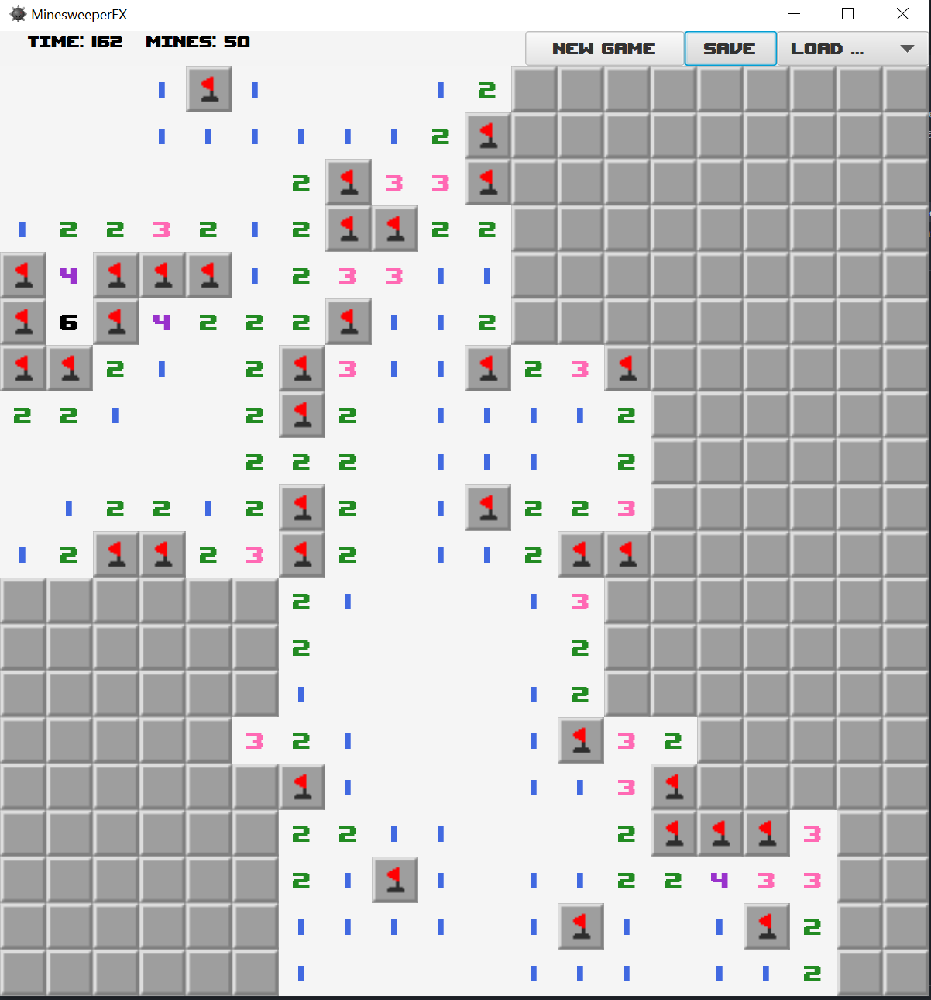

## Prosjekt - TDT4100 V2023
# Minesweeper

## Skildring av prosjektet

Prosjektet implementerer ein versjon av spelet Minesweeper. Dei fleste funksjonane er identiske til den originale versjonen, sett fekk ifrå nokre avgrensingar til storleik på brettet og antal miner.

### Køyring av applikasjonen

Ein kan køyre klassa via `main`-metoden i [`project.fxui.MinesweeperApp`] (./src/main/java/project/fxui/Minesweeper.java)-klassa.

### Logikk og struktur
#### Modell
Modellen består dei tre klassene - `Cell`, `Board` og `Game`.  `Cell` representerer kvar celle på brettet, definert i `Board`. Eit `Board`-objekt vert instansiert i `Game`-klassa, saman med ein tidtakar. `Game`-klassa modifiserar `Board`-objektet og handterer tilstandar i spelet, som tapt eller vunne. To andre klassar - `CellListener`

`Cell` inneheld tilstandane celler på brettet, med metodar for sjekke om ei celle er ei mine, er flagga eller er opna. `Cell`-instansane vert lagra i ei 2d-liste i `Board`.

I `Board` ligg logikken for å endre tilstandane til cellene, meir spsifikt logikken for å opne og flagge celler. For opning av celler inneberer dette logikk for å rekne ut alle cellene som skal opnast, gjennom rekursivt metodekall. I tillegg finn ein antal miner på brettet, og miner att trekt ifrå flagga celler (identisk til den originale versjonen av Minesweeper).

`Game` instansierer eit Board-objekt, i tillegg til å syte for ein tidtakar. Den er tenkt som ein "high-level" abstraksjon av sjølve spelet. Ideen var at `Board` skulle stå for endringar av tilstandar til celler, utan noko kjennskap til spelet og tilstandar som tapt/vunne. Eg valte å ikkje ha listener/ unødvendig å lytte til alle endringar til alle celler, når berre opning av første celle er relevant for å vurdere tilstand tapt/vunne

#### "Utility"-klasser

`CellListener` er eit interface som er knytt opp til controlleren. Slik  oppdaterast UI-en når tilstanden i ei celle vert endra.

`GameSaveHandler`sørger for lagring til/frå fil.

