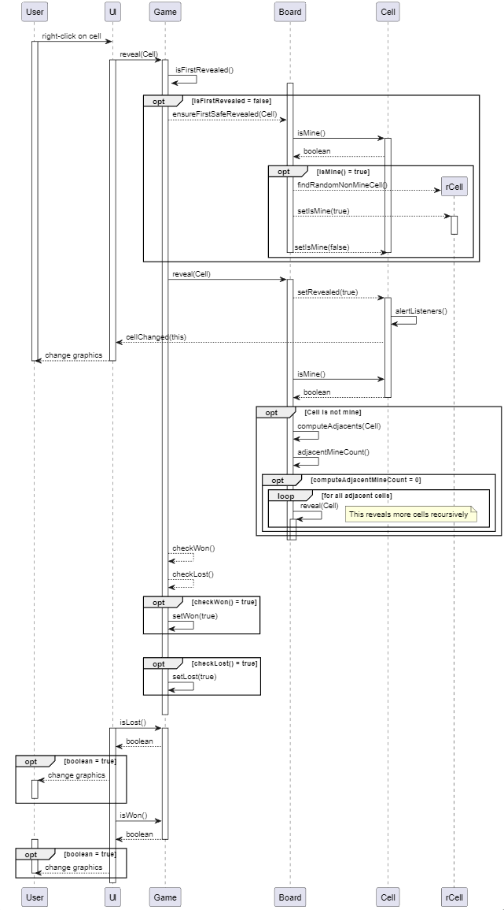

# Prosjekt TDT4100 V2023: Minesweeper

## Del 1: Skildring av prosjektet

Prosjektet implementerer ein versjon av spelet Minesweeper. Dei fleste funksjonane er identiske til den originale versjonen, sett fekk ifrå nokre avgrensingar til storleik på brettet og antal miner.

### Køyring av applikasjonen

Ein kan køyre klassa via `main`-metoden i [`project.fxui.MinesweeperApp.java`](./src/main/java/project/fxui/MinesweeperApp.java)-klassa.

### Logikk og struktur

#### Modell

Modellen består dei tre klassene - `Cell`, `Board` og `Game`. `Cell` representerer kvar celle på brettet, definert i `Board`. Eit `Board`-objekt vert instansiert i `Game`-klassa, saman med ein tidtakar. `Game` modifiserar `Board`-objektet og handterer tilstandar i spelet, som tapt eller vunne. I tillegg er det implementert to "utility"-klasser, `CellListener` og `GameSaveHandler`.

`Cell`-objektet reprsenterer kvar celle på brettet, med metodar for sjekke om ei celle er ei mine, er flagga eller er opna. `Cell`-instansane vert lagra i ei 2d-liste i `Board`, `Board.grid`.

I `Board` ligg logikken for å endre tilstandane til cellene, meir spesifikt logikken for å opne og flagge celler. For opning av celler inneberer dette logikk for å rekne ut alle cellene som skal opnast, gjennom rekursivt metodekall. I tillegg har klassa som oppgåva å halde styr på det totale antalet miner på brettet, og miner att trekt ifrå flagga celler (identisk til den originale versjonen av Minesweeper).

`Game` instansierer eit `Board`-objekt, i tillegg til å syte for ein tidtakar. Den er tenkt som ein "high-level" abstraksjon av sjølve spelet. Ideen var at `Board` skulle stå for endringar av tilstandar til celler, utan noko kjennskap til spelet og tilstandar som tapt/vunne. |||Eg valte å ikkje ha listener/ unødvendig å lytte til alle endringar til alle celler, når berre opning av første celle er relevant for å vurdere tilstand tapt/vunne|||

#### "Utility"-klasser

`CellListener` er eit interface som er knytt opp til controlleren. Slik oppdaterast UI-en når tilstanden i ei celle vert endra.

`GameSaveHandler`sørger for lagring til/frå fil.

## Del 2: Diagram

### Sequence diagram

Diagrammet vist over skildrar prosessen bak når brukaren vel å høgreklikke på ei celle i spelet. `Opt` viser optional prosess dersom kravet (i klammene) er oppfylt.

## Del 3: Spørsmål

1.  Eg har valt å bruke obervatør/observert-teknikken for å varsle UI om endringar i tilstanden til cellene på brettet. I samband med dette vert det brukt eit interface, `CellListener`. `MSController` implementerer dette interfacet, og har i oppgåve å lytte til endringar hos cellene. Delegering vert tildels brukt i `Board` og `Game`, når `Game` delegerer `reveal(Cell)`-metoden til `Board`-objektet i `Game`-objektets field. Årsaka til at eg løyse det slik, var at `reveal(Cell)` vil kunne påverke tilstanden til `Game` (vunne/tapt), men samstundes ville eg at `Board` skulle handtere sjølve "revealen".

2.  Arv er ikkje brukt i prosjektet, og eg ser ikkje føre meg kvar dette evt. kunne implementerast.

3.  Eg har forsøkt å skilje Model- og Controller-delen så godt som mogleg. Modellen er ikkje avhengig av UI-en for å fungere, og skal kunne fungere med andre implementasjonar. Controller-klassa `MSController` er nok litt i overkant lang og kompleks, men eg synest dette var nødvendig for å ikkje bryte MVC-prinsippet.

    Eit anna problem er at ein kan instansiere eit `Board`-objekt med eit gitt antal mines, utan at celle i `Board.grid` faktisk er oppdatert etter dette. Først etter at `Board.init()` er kalt, vil mine count i `Board` samsvarar med antal Cell-objekt som er miner i `Board.grid`. Grunnen til at eg har gjort det slik, er at `init()` konstrukterer eit nytt brett der miner er tilfeldig plassert i griden. Denne vert ikkje kalla i konstruktøren fordi det er i somme tilfelle hensiktmessig å initalisere eit brett utan tilfeldig plassering av miner. Tildømes i `load()`-metoden i `GameSaveHandler`, der initialiseringa av brettet vert gjort "manuelt" frå fil-data (sjå /java/project/model/GameSaveHandler.java frå linje 55) og ikkje tilfeldig.
    Ei løysing kunne vore å ha to konstruktørar i `Board`, der den eine initialiserer eit brett med tilfeldige plasseringar og den andre tillèt å plassere minene etter eige ønske.

4.  Testane tar for seg dei viktigaste funksjonane til modell-klassene `Board` og `Game` som tar for seg logikken i spelet, samt `GameSaveHandler` som tar for seg lagring til/frå fil. I `BoardTest` har eg fokusert på at flagging og reveal-algoritma fungerer som den skal, og i `GameTest` har eg testa at vunnen og tapt tilstand fungerer. I `GameSaveHandlerTest` har eg testa at systemet skiljer mellom lovlege og ulovlege filnamn. Eg har òg testa at ein får tilbake det same `Game`-objektet når lagrar det til fil og lastar det ned ved Load-funksjonen.
